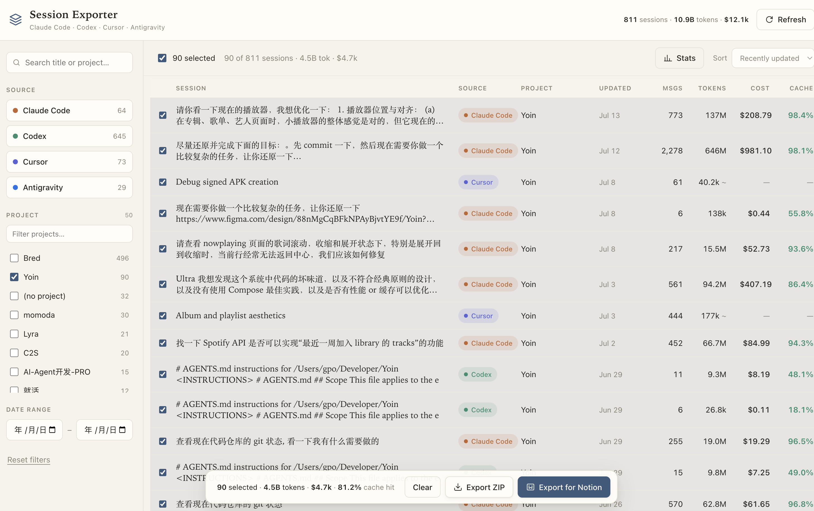
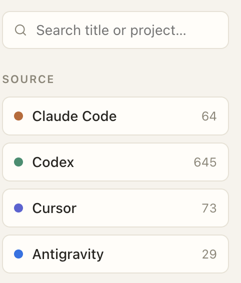
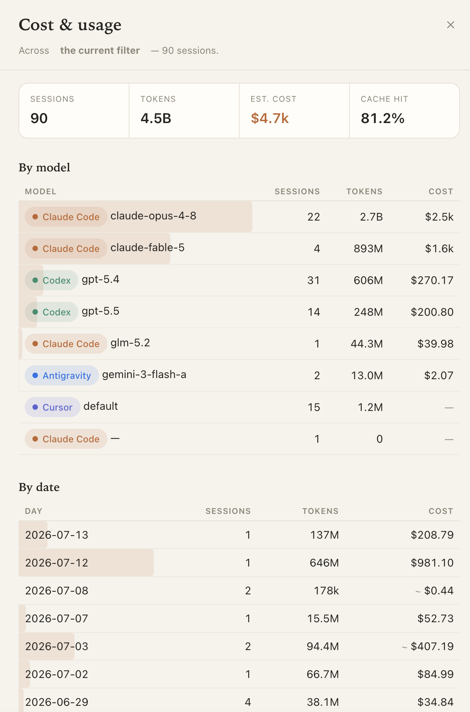

<div align="center">


# Session Exporter

**Browse & export your Claude Code / Codex / Cursor / Antigravity / Pi Agent / Kimi Code history — with token & cost accounting.**

English · [简体中文](README.zh-CN.md) · [日本語](README.ja.md)

[](LICENSE)
[](https://www.python.org/)
[](#)
[](https://p2o51.github.io/session-exporter/)

📖 **[Documentation](https://p2o51.github.io/session-exporter/)** · [快速开始](https://p2o51.github.io/session-exporter/zh/) · [ドキュメント](https://p2o51.github.io/session-exporter/ja/)

</div>

---

A small, elegant **local** web app that reads your **Claude Code**, **Codex**, **Cursor**,
**Antigravity**, **Pi Agent**, and **Kimi Code** session history, lets you browse and filter it, and exports
it — with real token accounting (including cache hits) and cache-aware **cost estimation**.
Nothing leaves your machine.

## Features

- **One list, six tools** — every Claude Code / Codex / Cursor / Antigravity / Pi Agent / Kimi Code session
  together. Filter by source, project folder, date range, and full-text search; sort by recency,
  cost, tokens, or size.
- **Multi-select → export menu** — select or select-all (following the active filter), then export
  as a ZIP archive, Notion import pack, JSON dump, or Markdown report (image export coming soon).
- **Token accounting with cache** — real, provider-recorded input / output / cache-read /
  cache-write / reasoning tokens, plus cache-hit rate, per session and per selection.
- **Cost estimation** — every session priced from its tokens × per-model rates, with provider-specific
  cache reads and Claude / Pi / Kimi cache writes billed correctly. Expand the selection bar for **Stats**
  by model and by date. Rates live in an editable [`pricing.json`](pricing.json).
- **Local & private** — pure Python 3.9+ standard library, **zero dependencies**. Cursor,
  Antigravity, and other local databases are opened strictly read-only.

## Screenshots



*Main list and selection bar*



*Source chips*



*Cost & usage stats*

## Quick start

```bash
git clone https://github.com/p2o51/session-exporter.git
cd session-exporter
python3 app.py
```

Your browser opens at **http://127.0.0.1:8765**. No build step, no `pip install`.

```bash
python3 app.py --port 9000     # different port
python3 app.py --no-open       # don't auto-open the browser
```

The first launch indexes your history (~10 s — Codex keeps large rollout files, which are
streamed) and caches the result, so relaunches are instant. Hit **Refresh** to re-scan.

## Where the data comes from

| Source | Location | Token basis |
| --- | --- | --- |
| **Claude Code** | `~/.claude/projects/<folder>/<uuid>.jsonl` | `recorded` — summed `usage`, incl. cache create/read |
| **Codex** | `~/.codex/sessions/**/rollout-*.jsonl` (+ `archived_sessions/`) | `recorded` — final `token_count` (incl. cached input & reasoning) |
| **Cursor** | global SQLite `…/Cursor/User/globalStorage/state.vscdb` (read-only) | `context-snapshot` — final context size, not spend |
| **Antigravity** | `~/.gemini/antigravity{,-cli}/conversations/*.db` (read-only) | `recorded` — `gen_metadata` usage (input, cache read, output, reasoning) |
| **Pi Agent** | `~/.pi/agent/sessions/**/*.jsonl` | `recorded` — per-turn `usage` (input, output, cacheRead, cacheWrite) |
| **Kimi Code** | `$KIMI_CODE_HOME/sessions/**/` (default `~/.kimi-code`) | `recorded` — `usage.record` (uncached input, output, cache read/create) |

A `~` flags non-`recorded` numbers so the accounting stays honest; Cursor sessions aren't priced.

## Project layout

```
app.py            entry point (starts the server, opens the browser)
server.py         stdlib HTTP server + JSON/zip API
model.py          in-memory + on-disk index, token aggregation
pricing.py        per-model, cache-aware cost engine
pricing.json      editable per-model rates ($/1M tokens)
exporters.py      ZIP / Notion / JSON / Markdown export builders
parsers/          claude · codex · cursor · antigravity · pi · kimi (one contract per source)
web/              index.html · styles.css · app.js  (the UI)
website/          the Rspress documentation site (trilingual)
```

Each parser implements one small contract (`list_sessions()` / `load_messages()`), so adding a
new source is a single new file in [`parsers/`](parsers/).

## Documentation

Full docs (English / 简体中文 / 日本語) live at **https://p2o51.github.io/session-exporter/**,
built with [Rspress](https://rspress.rs/) and deployed via GitHub Actions from [`website/`](website/).

## License

[MIT](LICENSE) © 2026 Chen Wuyi ([@p2o51](https://github.com/p2o51))
